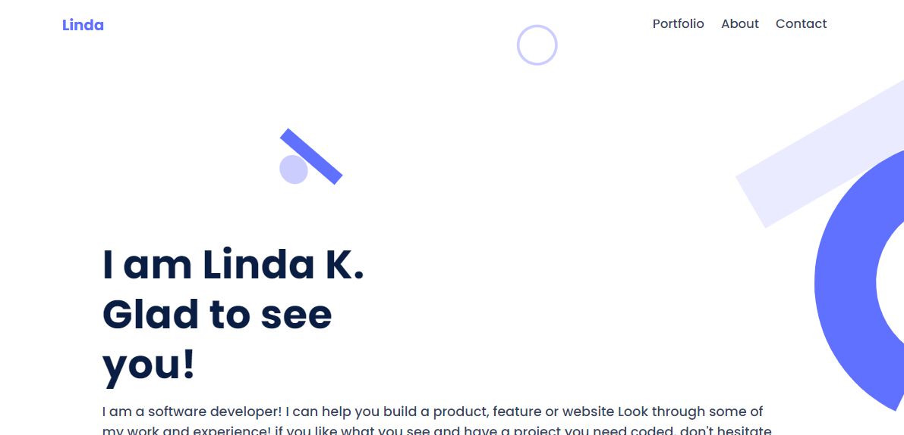
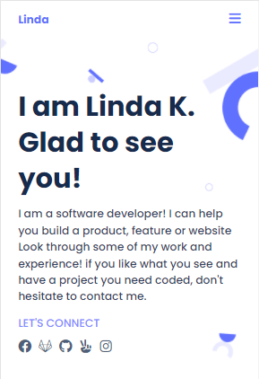

# linda-portfolio-part2
A portfolio is a compilation of materials that exemplifies your beliefs, skills, qualifications, education, training and experiences. It provides insight into your personality and work ethic. 

### Desktop version view

### Mobile version view

## Built With

- HTML
- CSS
- Linters
- Figma
- Javascript
- VS code

## Live Demo

For the link to the live demo, [Click here](https://keza681.github.io/Linda-portfolio/)

Prerequisites

You only need a browser to run the html file.

## 👤 Author

- GitHub: [@githubhandle](https://github.com/keza681)
- Twitter: [@twitterhandle](https://twitter.com/LKeza19)
- LinkedIn: [LinkedIn](https://www.linkedin.com/in/linda-keza/)

## 🤝 Contributing

Contributions, issues, and feature requests are welcome!

Feel free to check the [issues page](../../issues/).

## Show your support

Give a ⭐️ if you like this project!

## 📝 License

## Acknowledgments

- Hat tip to anyone whose code was used
- Inspiration
- etc

This project is [MIT](./MIT.md) licensed.

