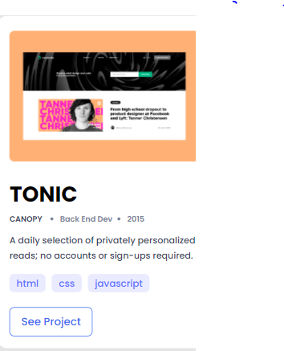

# linda-portfolio-part2
I'm working on the portofolio project. This is the middle part.  

## Built With

-HTML
-CSS
-FIGMA

## 👤 Author

- GitHub: [@githubhandle](https://github.com/keza681)
- Twitter: [@twitterhandle](https://twitter.com/LKeza19)
- LinkedIn: [LinkedIn](https://www.linkedin.com/in/linda-keza-a10150218/)

## Show your support

Give a ⭐️ if you like this project!

## 📝 License

This project is [MIT](./MIT.md) licensed.